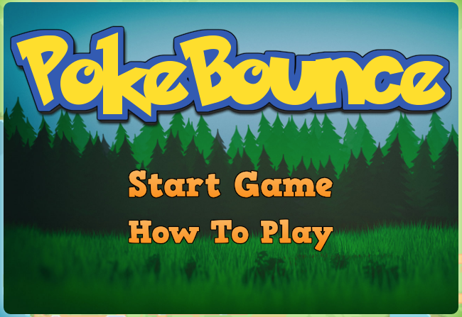
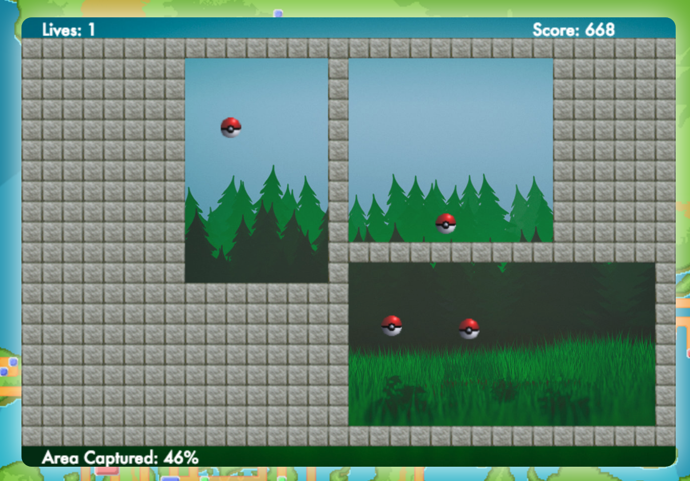

# PokeBounce
[PokeBounce live](http://www.playpokebounce.com)

## Background
PokeBounce is a single player dynamic area capture game built using Javascript (with EaselJS), HTML, and CSS. The player must capture areas of a rectangular playing field containing Pokéballs which bounce around within the space.

## How to Play
Players can initiate building a wall by clicking the desired start location for that wall. Once initiated, the wall will begin to build in both directions from the click point. When each section of the wall reaches the edge of the playing field, it becomes solid and the Pokéballs can now bounce off it. However, if an Pokéball collides with either section of the wall before it is finished being built the entire wall section will disappear and the player will lose a life. If a section of the playing field is completely walled off contains no Pokéballs, that section will automatically fill in with wall. Right clicking (or pressing spacebar), toggles the cursor to indicate whether a vertical or horizontal wall will be built on click.

If the player successfully captures 75% of the field, the level is one and the next level begins with one additional starting Pokéball. Each level gives the player a number of lives equal to the number of starting Pokéballs (the first level has two Pokéballs). If all lives are lost within a level, the game is lost.

## Future Improvements

### Collision Response Adjustments
- On some edge cases, Pokéballs occasionally get stuck to each other or to walls because of a bug in the collision response algorithm. I would like to update the collision response algorithm to correct for this.
